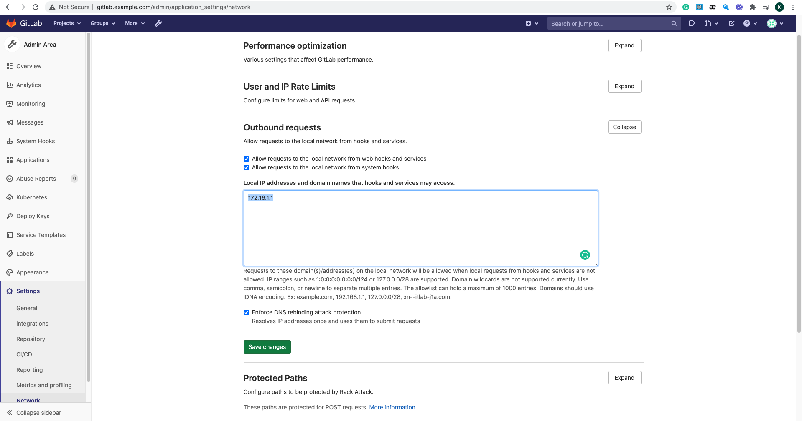
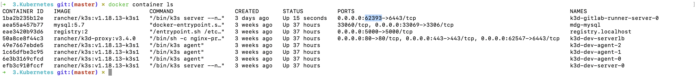
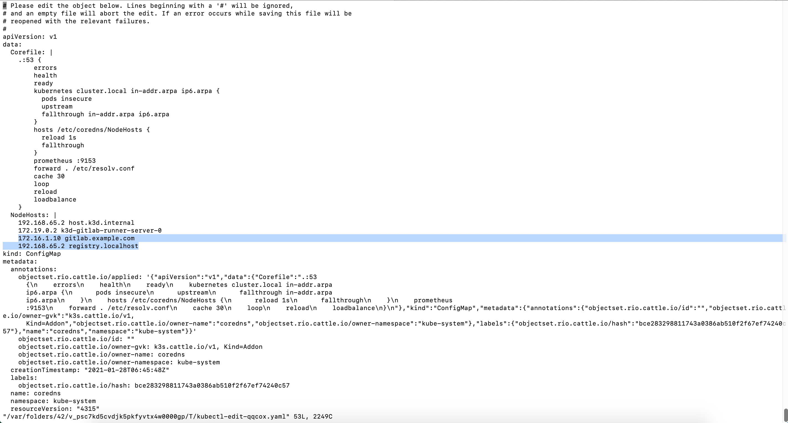

# Prerequisites

- Virtualbox
- Vagrant

# Start gitlab server

```bash
vagrant up
```

# Modify `/etc/hosts`

Add these lines to `/etc/hosts`

```
172.16.1.10 gitlab.example.com
```

And then access local gitlab server at: http://gitlab.example.com

Set password for root user (username is `root`)

# Allow local access on gitlab

Go to `Admin` -> `Settings` -> `Network` -> `Outbound requests`

Check `Allow requests to the local network from web hooks and services`

Add `172.16.1.1` (host IP address) to the textarea



# Spin up a gitlab runner cluster

```bash
k3d cluster create gitlab-runner \
    --image rancher/k3s:v1.18.13-k3s1 \
    --k3s-server-arg '--no-deploy=traefik' \
    --no-lb \
    --volume "${PWD}/registries.yaml:/etc/rancher/k3s/registries.yaml"
```

Get runner cluster endpoint

```bash
docker container ls
```

Note down the cluster port



# Add gitlab.example.com domain to runner cluster DNS resolution

```bash 
kubectl edit configmap coredns -n kube-system --context k3d-gitlab-runner

kubectl rollout restart deployment coredns -n kube-system --context k3d-gitlab-runner
```

Add 

```
172.16.1.10 gitlab.example.com
<HOST_IP> registry.localhost
```

to `NodeHosts` section



# Create gitlab service account on runner cluster

```bash
kubectl apply -f gitlab-admin-service-account.yaml --context k3d-gitlab-runner
```

Get service account infos:

```bash
SECRET_NAME=$(kubectl get sa gitlab -o "jsonpath={.secrets[0].name}" -n kube-system)

# Service Token
kubectl get secret $SECRET_NAME -o "jsonpath={.data.token}" -n kube-system | base64 -d

# CA Certificate
kubectl get secret $SECRET_NAME -o "jsonpath={.data['ca\.crt']}" -n kube-system | base64 -d
```

# Register kubernetes cluster

Go to `Admin` -> `Kubernetes` -> `Connect cluster ...` -> `Connect existing cluster`

Enter the infos:

Cluster name: `local-runner`

API URL: `https://172.16.1.1:<CLUSTER_PORT>`

CA Certificate + Service Token: Gotten in previous step

-> `Add kubernetes cluster`

# Install gitlab runner

In `local-runner` kubenetes cluster screen

Go to `Applications` -> `Install gitlab runner`

# Stop

```bash
vagrant suspend

k3d cluster stop gitlab-runner
```

# Clean up

```bash
vagrant destroy

k3d cluster delete gitlab-runner
```
