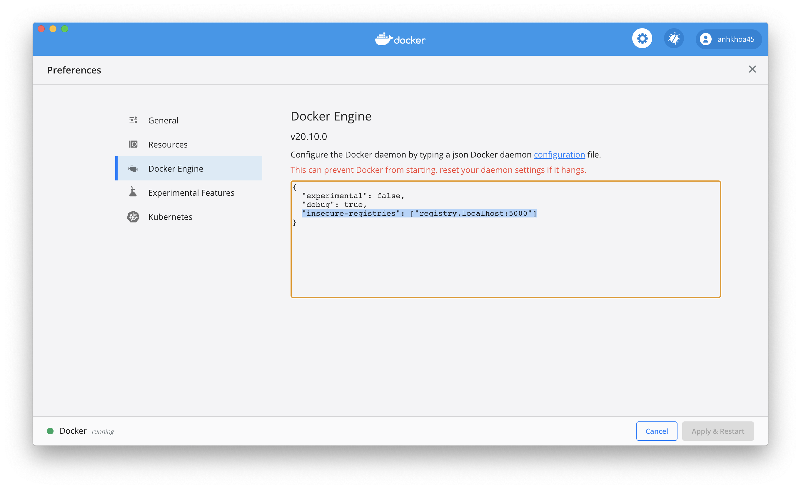

# Setup local development environment

**1. Install k3d**

```bash
brew install k3d
```

Start a development cluster

```bash
k3d cluster create dev -a 3 \
    --port 80:80@loadbalancer --port 443:443@loadbalancer \
    --image rancher/k3s:v1.18.13-k3s1 \
    --k3s-server-arg '--no-deploy=traefik' \
    --volume "${PWD}/registries.yaml:/etc/rancher/k3s/registries.yaml"
```

**Notes:**
- I tried a multi-master nodes cluster, but there were some problems with the etcd db, so I use the default single master node cluster option.
- `rancher/k3s:v1.18.13-k3s1` image is used for upstream compatibility with stg and production cluster. Other versions are available at https://hub.docker.com/r/rancher/k3s/tags
- Set `'--no-deploy=traefik'` to disable `traefik` - the default ingress controller. We'll use nginx ingress controller instead for upstream compatibility.
- There's an issue that the cluster sometime can't create new pods. Just restart the cluster and deploy again.

```bash
k3d cluster stop dev
k3d cluster start dev
```

**References:**
- K3d docs: https://k3d.io/
- Dennis san's blog post: https://qiita.com/dennistanaka/items/78585b6bda374be98aad
- Sokube's blog post: https://en.sokube.ch/post/k3s-k3d-k8s-a-new-perfect-match-for-dev-and-test

**2. Install Nginx ingress controller**

```bash
kubectl create ns ingress-nginx

kubectl apply -f nginx-ingress-controller.yaml
```

Confirm nginx ingress is up

```bash
kubectl get svc -n ingress-nginx
```

```
NAME                                                          TYPE           CLUSTER-IP     EXTERNAL-IP   PORT(S)                      AGE
ingress-controller-nginx-ingress-nginx-controller-admission   ClusterIP      10.43.60.148   <none>        443/TCP                      2m17s
ingress-controller-nginx-ingress-nginx-controller             LoadBalancer   10.43.196.52   172.24.0.5    80:30437/TCP,443:32612/TCP   2m17s
```

**3. Create local docker registry**

```bash
docker run -d --name registry.localhost -p 5000:5000 --restart always registry:2

docker network connect k3d-dev registry.localhost
```

And add these lines to `/etc/hosts`

```bash
127.0.0.1  registry.localhost
```

Go to `Docker` -> `Preferences` -> `Docker Engine` and add these lines to the setting:

```json
"insecure-registries": ["registry.localhost:5000"]
```



**Notes**: The local registry doesn't really provide a convinient way to delete images. To free disk space, just simply destroy the registry with `docker container rm -f -v registry.localhost` and create a new one

## Clean up

**Delete local docker registry**

```bash
docker container rm -f -v registry.localhost
```

**Delete k3d cluster**

```bash
k3d cluster delete dev
```

**Clean up unused volumes**

```bash
docker volume prune
```